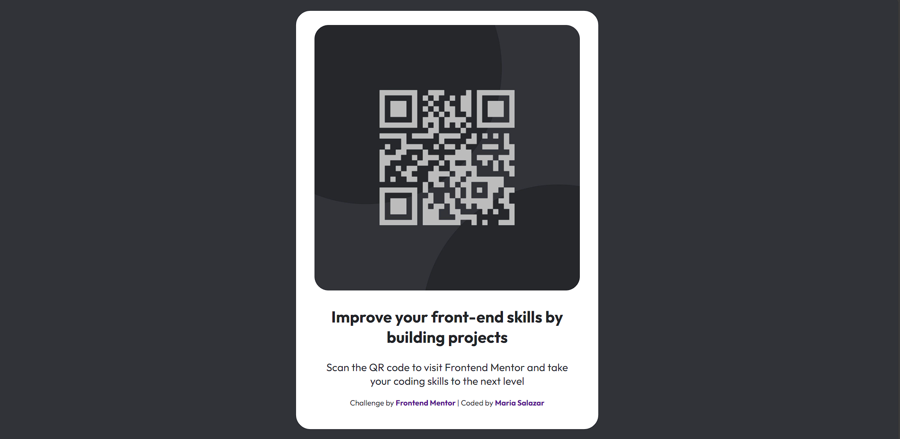

# Frontend Mentor - QR code component

## Thanks for watching my challenge!

This front-end coding challenge is from [Frontend Mentor](https://www.frontendmentor.io) challenges, that helps and improves the coding skills by building realistic projects.

**The challenge is a basic understanding of HTML and CSS, with only the desktop version (full screen). It can be updated.**

## The challenge

My challenge is to build out this QR code component and get it looking like my own style rather the original design.

Want some more challenges but don't know when or where? [Join the Frontend Mentor community](https://www.frontendmentor.io/community) and ask questions in the **#help** channel.